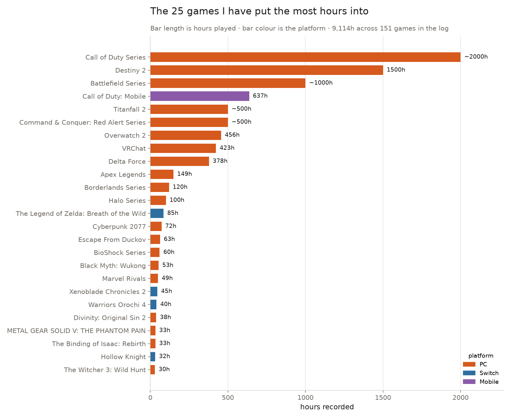

# Twenty-two years of games, counted

Using my own play records as the dataset for this assignment, rather than a
published dataset of a natural phenomenon, was agreed with the course lecturer,
Giovanni Lion, before I started.



## What this is

Every game I have played for long enough to keep a record of, with the hours I
put into each one. The log exists because I write about games and design them,
and "I play a lot of shooters" is a claim that gets more useful once it has
numbers under it.

## Where the numbers come from

My own playtime log, assembled from three sources: Steam, through the
[`GetOwnedGames` endpoint](https://developer.valvesoftware.com/wiki/Steam_Web_API)
of the Steam Web API; the Nintendo Switch's own playtime export; and hand-entered
records for PlayStation, Xbox and mobile titles, where no usable API exists.
`hoursSource` on each record says which of the three it came from.

`data/games.generated.json` is that export, committed byte for byte and the only
thing the scripts read. It holds 224 records; a record is one game, and `hours`
is time played **in hours**, as an integer. 208 are visible, 151 of them with
hours on them. `hoursQualifier` marks each number `exact`, `approx` or `minimum`,
and the picture prints `~` and `≥` for the two estimates rather than pretending
the precision is the same.

## What the picture shows

Bar length is hours played; bar colour is the platform; the 25 longest are
shown, longest at the top. One message: where the time actually went. The top
three are series cards that roll several titles into one row, and the drop from
2,000 hours to 637 is not a gentle curve — it is a cliff, which is the honest
shape of a playtime log.

**What it hides.** It hides the 126 games outside the top 25, which together
account for a little over a thousand of the 9,114 hours. It hides genre
entirely, so a bar labelled *VRChat* gives no hint that it is not a shooter. It
flattens `approx` and `minimum` into the same bar length as `exact`, with only a
one-character mark to warn you. And the axis stops at 2,000, so the four series
cards at the top visually dominate a distribution that is mostly games under
50 hours.

## Run it

```
uv run fetch.py
uv run plot.py
```

`fetch.py` copies the export into `data/` if it is not already there; the file is
committed, so with the wifi off it simply reports that it is present.
`plot.py` reads `data/` and writes `out/plot.png`.
